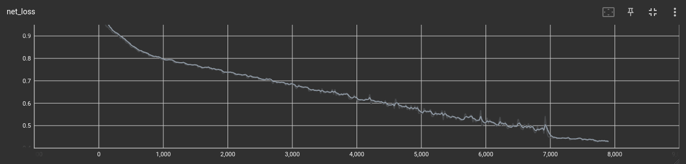

<p align="center">
    <a href="https://github.com/Qyy2737242319/xjtuse-intern-portrait/edit/main/rating_evaluate">
      
    </a>
    <a href="#">
        
    </a>
</p>

## Train Result

 </img>

## environment preparation

```
conda env create -f requirements.yml
pip install -r requirements.txt
```

### using tensorboard to supervise training data

```
tensorboard --logdir ./logs
```
